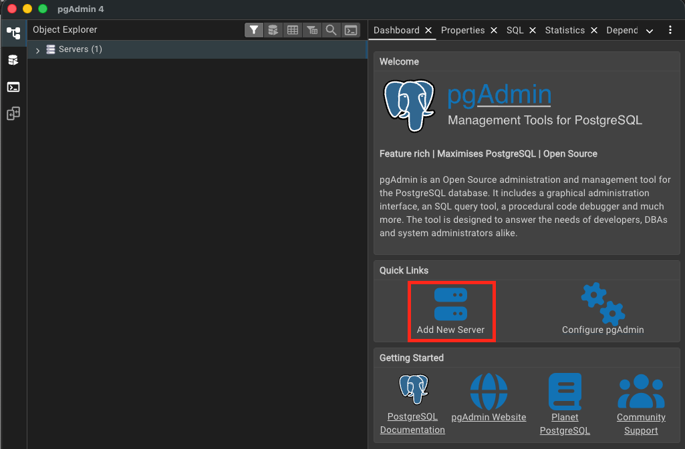
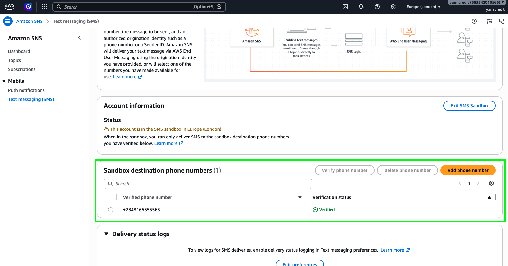

# yamibackend
Repository to host yami backend.


## Development setup

### The EF Core CLI Tool
`dotnet-ef` is a command line tool that runs on your machine to generate migration files. Install it using the command below.

```bash
dotnet tool install --global dotnet-ef
```

### Clean and Restore
The commands below help you start your build on a clean slate.

```bash
dotnet clean
dotnet nuget locals all --clear
dotnet restore
```

### Setup Object Relational Mapping (ORM)

`dotnet ef migrations add` reads your DbContext/model classes and generates a C# file describing "here's the SQL needed to create this schema." This has to happen every time you change your models (e.g., add a new property later).

`dotnet ef database update` runs the generated migration against your DB, physically creating the Users table.

> [!NOTE]
> Before you use `dotnet ef` to set up your database, make sure it is running by following the instructions in [Run a local PostgreSQL DB](#run-a-local-postgresql-db)

```bash
export ConnectionStrings__DefaultConnection='Host=localhost;Port=5432;Database=yami;Username=yami;Password=yami'
dotnet ef migrations add InitialCreate \
  --project src/Yami.Features/Users/Users.csproj \
  --startup-project src/Yami.Api/Yami.Api.csproj \
  --context UsersDbContext \
  --output-dir EFInfrastructure/Data/Migrations

export ConnectionStrings__DefaultConnection='Host=localhost;Port=5432;Database=yami;Username=yami;Password=yami'
dotnet ef database update \
  --project src/Yami.Features/Users/Users.csproj \
  --startup-project src/Yami.Api/Yami.Api.csproj \
  --context UsersDbContext
```

If You've created the database before and you need to start on a clean DB slate, run:

```bash
export ConnectionStrings__DefaultConnection='Host=localhost;Port=5432;Database=yami;Username=yami;Password=yami'
dotnet ef database drop \
  --project src/Yami.Features/Users/Users.csproj \
  --startup-project src/Yami.Api/Yami.Api.csproj \
  --context UsersDbContext \
  --force
  ```

Delete the src/Yami.Features/Users/EFInfrastructure folder and then run the `dotnet ef migrations` and `dotnet ef database update` above again:

### Run the app 
```bash
export ConnectionStrings__DefaultConnection='Host=localhost;Port=5432;Database=yami;Username=yami;Password=yami'
dotnet run \
  --project src/Yami.Api/Yami.Api.csproj \
  --environment Development
```


## Run a local PostgreSQL DB
``` bash
docker run --name yami-postgres \
  -e POSTGRES_USER=yami \
  -e POSTGRES_PASSWORD=yami \
  -e POSTGRES_DB=yami \
  -p 5432:5432 \
  -v yami-postgres-data:/var/lib/postgresql/data \
  -d postgres:16
```

start, stop or remove the DB container
```bash
docker stop yami-postgres
docker start yami-postgres
docker rm -f yami-postgres
```

To view data via a GUI; 
- [Download and install pgadmin](https://www.pgadmin.org/download/)
- Open pgadmin click on `Add New Server` (picture reference below)
- Connect with:

```bash
Name: Yami
Host: localhost
Port: 5432
Database: yami
Username: yami
Password: yami
```
<br>
<br>




## Test how this setup is wired with cognito

> [!WARNING]
> This test instructions assumes you are running on a unix compatible setup like macos or linux.
> If you are running on a windows machine, most commands will work but you may run into friction with some.
> You can install wsl to reduce friction. This gives you a linux terminal on windows

The Example flow here is for new user registration but the same flow can be extended to other operations.

Pre requisites
- run `dotnet ef migrations` described above
- run the database docker image as described above
- run `dotnet ef database update` as described above
- run the app with `dotnet run` as described above

Open another terminal window to configure aws credentials
- install aws cli
- run aws login and follow the link provided
- on the aws website, go to `Amazon SNS`. You can type it into the search bar at the top left for quick navigation
- go to the `Sandbox destination phone numbers` section and add your phone number. (picture reference below)
<br>
<br>



<br>
<br>

- go back to the terminal window and signup through cognito using the command below. The username should be your phone number in +234... format. The password can be anything you choose
```bash
aws cognito-idp sign-up \
--region "eu-west-2" \
--client-id "4mufv3uf5529dsfaq47cdbpclh" \
--username "+234_PHONE_NUMBER" \
--password "Password123" \
--user-attributes Name=phone_number,Value="+234_PHONE_NUMBER"
```

- you will receive an otp from YAMI-CREDIT
- return the otp to cognito with the following command. replace the username with your own phone number
```bash
aws cognito-idp confirm-sign-up \
--region eu-west-2 \
--client-id 4mufv3uf5529dsfaq47cdbpclh \
--username "+234_PHONE_NUMBER" \
--confirmation-code  <OTP_FROM_SMS>
```
- get tokens from cognito for authenticating with the backend by running the command below.
```bash
aws cognito-idp initiate-auth \
--region eu-west-2 \
--client-id 4mufv3uf5529dsfaq47cdbpclh \
--auth-flow USER_PASSWORD_AUTH \
--auth-parameters \
  USERNAME="+234_PHONE_NUMBER",PASSWORD="Password123" > tokens.json
```

- extract the IdToken in the returned jwt by cognito into a local variable
```bash
export TOKEN=$(cat tokens.json | jq -r .AuthenticationResult.IdToken)
```

- if you want, you can examine the token using
```bash
echo $TOKEN
```
- try to register yourself on the backend by using
```bash
curl -v -X POST http://localhost:5000/api/v1/users \
  -H "Content-Type: application/json" \
  -H "Authorization: Bearer $TOKEN" \
  -d '{"phone": "+234_PHONE_NUMBER", "name": "Any Name", "userType": "wholesaler", "dateOfBirth": "13-03-1974"}'
```
- you should get a `User registered successfully` response message and the user will be visible in the database
- If you send the same curl request again, you should get a `This phone number is already registered` error.

> [!NOTE]
> Please ignore the ./docker/Dokerfile. It's just there as a placeholder for now